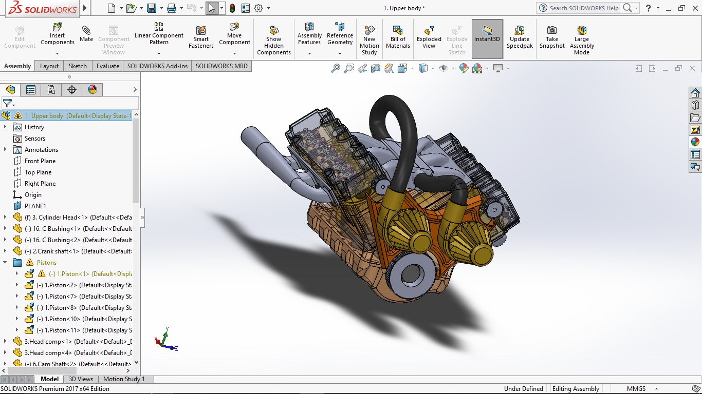

V6 Twin Turbo IC Engine

Overview
This project is a 3D model of a V6 Twin Turbo Internal Combustion (IC) Engine, designed using SolidWorks. The model demonstrates the structural and functional elements of a high-performance V6 engine equipped with twin turbochargers, providing an educational resource for understanding engine design and dynamics.

Features
Detailed Engine Design: Comprehensive 3D model featuring key engine components.
Twin Turbocharger Integration: Shows how twin turbos enhance power output by increasing airflow.
Exploded View: Components can be viewed individually in an exploded layout.
Simulated Motion: Includes animations of pistons and crankshaft to demonstrate engine operation.
Project Structure
/Models: SolidWorks part and assembly files of the V6 engine.
/Renders: Rendered images and animations displaying various views of the engine.
/Documentation: Technical details, exploded views, and component descriptions.
Getting Started
To view or modify this model, you’ll need:

SolidWorks (preferably version 2018 or later)
Steps to Open the Project
Clone the repository:
bash
Copy code
git clone https://github.com/Sumit-0204/V6-Twin-Turbo-IC-Engine.git
Open the assembly file in SolidWorks to explore the engine model.
How It Works
The V6 Twin Turbo IC Engine model follows the principles of internal combustion, where the twin turbochargers increase air intake to boost horsepower. The model includes realistic part relationships, allowing users to observe the interaction of pistons, crankshaft, and other components.

Applications
Educational Tool: Ideal for students and enthusiasts learning about automotive engineering.
Design Inspiration: Provides a detailed reference for custom automotive projects.
Contributing
Contributions are welcome! Feel free to fork this repository and submit pull requests with improvements.

Contact
For questions or suggestions, please reach out at sumitnaskar950@gmail.com!

